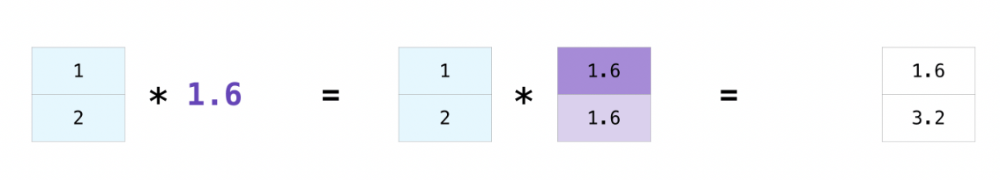
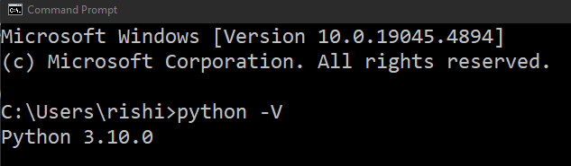
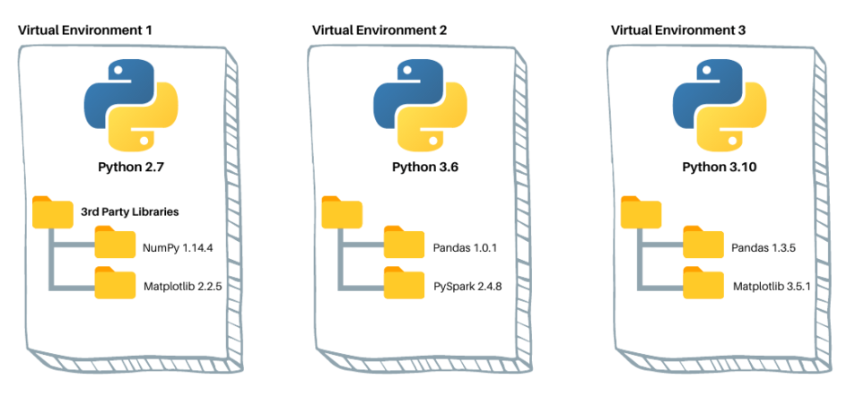
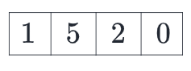
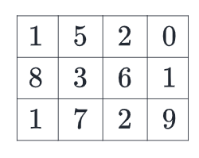

# Introduction to NumPy

> This is an introductory course on Numpy.

Tools used:

- Python 3.10
- NumPy 1.26.4
- Jupyter Notebook

## Table of contents

1. [Introduction](https://github.com/backstreetbrogrammer/53_IntroductionToNumPy?tab=readme-ov-file#chapter-1-introduction)
2. [Installation and Setup](https://github.com/backstreetbrogrammer/53_IntroductionToNumPy?tab=readme-ov-file#chapter-2-installation-and-setup)
3. [Array Fundamentals](https://github.com/backstreetbrogrammer/53_IntroductionToNumPy?tab=readme-ov-file#chapter-3-array-fundamentals)
4. [Introduction_To_NumPy Jupyter Notebook](https://github.com/backstreetbrogrammer/53_IntroductionToNumPy/blob/main/Introduction_To_NumPy.ipynb)

## Youtube


[Introduction To NumPy playlist](https://www.youtube.com/playlist?list=PLQDzPczdXrTiJ7p3Aa6JyT6gzNtmTh-3l)

---

## Chapter 1. Introduction

`NumPy` is the fundamental package for scientific computing in Python.

The `NumPy` library contains **multidimensional** array data structures, such as the **homogeneous**, **N-dimensional**
`ndarray`, and a large library of functions being performed in **compiled code** that operate efficiently on these data
structures.

_**Differences between `NumPy` arrays and the standard Python sequences:**_

- `NumPy` arrays have a **fixed size** at creation, unlike Python `lists` (which can grow dynamically). Changing the
  size of an `ndarray` will create a new array and delete the original.
- The elements in a `NumPy` array are all required to be of the **same data type**, and thus will be the same size in
  memory.
- `NumPy` arrays facilitate advanced mathematical and other types of operations on **large numbers of data**. Typically,
  such operations are executed more efficiently and with less code than is possible using Python's built-in sequences.
- A growing plethora of scientific and mathematical Python-based packages are using `NumPy` arrays; though these
  typically support Python-sequence input, they convert such input to `NumPy` arrays prior to processing, and they often
  output `NumPy` arrays.

_**Why is NumPy fast?**_

The points about sequence's **size** and **speed** are particularly important in scientific computing.

As a simple example, consider the case of multiplying each element in a **1-D sequence** with the corresponding element
in another sequence of the same length.

If the data is stored in two Python **lists**, `a` and `b`, we could iterate over each element:

```
c = []
for i in range(len(a)):
    c.append(a[i] * b[i])
```

This produces the correct answer, but if `a` and `b` each contain **millions** of numbers, we will pay the price for the
inefficiencies of **looping** in Python.

We could accomplish the same task much more quickly in `C` by writing:

```
for (i = 0; i < rows; i++) {
  c[i] = a[i] * b[i];
}
```

Furthermore, the coding work required increases with the **dimensionality** of our data.

In the case of a **2-D array**, for example, the `C` code expands to:

```
for (i = 0; i < rows; i++) {
  for (j = 0; j < columns; j++) {
    c[i][j] = a[i][j]*b[i][j];
  }
}
```

`NumPy` gives us the best of both worlds: element-by-element operations are the **“default mode”** when an `ndarray` is
involved, but the element-by-element operation is speedily executed by **pre-compiled C code**.

In `NumPy`:

```
c = a * b
```

This does what the earlier examples do, at **near-C speeds**, but with the code simplicity we expect from something
based on Python.

Indeed, the `NumPy` idiom is even simpler!

This last example illustrates two of `NumPy`’s features which are the basis of much of its power:

- Vectorization
- Broadcasting

**Vectorization**

Vectorization describes the absence of any explicit looping, indexing, etc., in the code - these things are taking place
just **“behind the scenes”** in **optimized**, **pre-compiled C code**.

Vectorized code has many advantages, among which are:

- vectorized code is more concise and easier to read
- fewer lines of code generally means fewer bugs
- the code more closely resembles standard mathematical notation (making it easier, typically, to correctly code
  mathematical constructs)
- vectorization results in more **“Pythonic”** code. Without vectorization, our code would be littered with inefficient
  and difficult to read `for` loops.

**Broadcasting**

Broadcasting is the term used to describe the implicit element-by-element behavior of operations; generally speaking, in
`NumPy` all operations, not just arithmetic operations, but logical, bit-wise, functional, etc., behave in this implicit
element-by-element fashion, i.e., they broadcast.

Moreover, in the example above, `a` and `b` could be multidimensional arrays of the same shape, or a scalar and an
array, or even two arrays with different shapes, if the smaller array is **“expandable”** to the shape of the larger in
such a way that the resulting broadcast is unambiguous.



### Youtube

- [01 - Introduction to Numpy - Tutorial Series](https://youtu.be/ZURPUJ7J5hM)

---

## Chapter 2. Installation and Setup

**Download and Install Python**

[Python Download](https://www.python.org/downloads/)

**Verify Installation**

- Open a command prompt
- Type command `python -V`



**Python Virtual Environments**



- **Isolates** the Python interpreter, libraries and scripts used in a specific project
- Enables **multiple** environments on our computer, each with different versions of Python and its packages, without
  them interfering with each other
- Think of it as a **sandbox**, where we can play around with different packages and their versions without worrying
  about messing up our other sandboxes

**Python Virtual environment on Windows**

- Open a command prompt
- Move to the project folder: `cd test`
- Type: `python -m venv venv` => this will create a new virtual environment named **"venv"** inside our project
  (**test** folder)
- Activate the virtual environment: `venv\Scripts\activate`
- Deactivate the virtual environment: `deactivate`

If using Powershell instead of command prompt, please remember to run this command to avoid any permission errors:

`Set-ExecutionPolicy -Scope User Unrestricted`

We can also create a file with all our installed modules and versions which can be used to create exactly the same
virtual environment in a different machine.

For ex:

- Command: `python -m pip freeze > requirements.txt` => this will create **requirements.txt** file containing all
  our installed modules with versions
- To install the same modules in a different virtual environment => `python -m pip install -r requirements.txt`

**Upgrade pip**

We should consider upgrading **pip** once we create our virtual environment.

This can be done by simply typing this command from inside our virtual environment:

`python -m pip install -U pip`

### Set up our project

**Download and Install Anaconda**

[Anaconda Home Page](https://www.anaconda.com/)

[Windows Installer](https://repo.anaconda.com/archive/Anaconda3-2024.02-1-Windows-x86_64.exe)

**Create a new virtual env**

From Anaconda Command Prompt:

```
conda create --name <env_name> python=<version>

# Example:
conda create --name intro_to_numpy python=3.10
```

List and activate the environment:

```
conda env list
conda activate intro_to_numpy
```

Install modules:

```
# mandatory
python -m pip install -U pandas
python -m pip install -U matplotlib
python -m pip install -U notebook

# optional
python -m pip install -U bottleneck
python -m pip install -U numexpr
python -m pip install -U jupyterlab
python -m pip install -U --force-reinstall charset-normalizer  
```

**Optional modules details**

- `bottleneck`: Bottleneck is a collection of fast NumPy array functions written in C.
- `numexpr`: Fast numerical expression evaluator for NumPy.
- `jupyterlab`: An extensible environment for interactive and reproducible computing, based on the Jupyter Notebook and
  Architecture.
- `charset-normalizer`: A library that helps read text from an **_unknown_** charset encoding.

Alternatively, if we want to see our Jupyter notebook in **DARK** mode, run this command:

```
jt -t onedork -f roboto -cellw 95%
```

Now all setup is done, lets move to the working directory and launch jupyter notebook:

```
cd <workspace>

# launch notebook
jupyter notebook
```

Deactivate and come out of virtual env:

```
conda deactivate
```

To delete an environment, run the command below:

```
conda remove --name <env_name> --all
```

`<env_name>` denotes the name of the environment to be removed/deleted.

We need to ensure that we deactivate an environment before removing it by running the conda deactivate command.

The `--all` flag removes all the packages installed in that environment.

### Youtube

- [02 - Python installation and virtual environment setup](https://youtu.be/tU6pn3n5ur8)
- [03 - Anaconda installation and project setup](https://youtu.be/s_7LPsSQovQ)

---

## Chapter 3. Array Fundamentals

In computer programming, an **array** is a structure for storing and retrieving data.

We often talk about an array as if it were a grid in space, with each cell storing one element of the data.

For instance, if each element of the data were a **number**, we might visualize a **“one-dimensional”** array like a
**list**:



A **two-dimensional** array would be like a **table**:



In `NumPy`, this idea is generalized to an arbitrary number of dimensions, and so the fundamental array class is called
`ndarray`: it represents an **“N-dimensional array”**.

Most `NumPy` arrays have some restrictions. For instance:

- All elements of the array must be of the **same** type of data.
- Once created, the total size of the array can **NOT** change.
- The shape must be **“rectangular”**, not **“jagged”**; e.g., each row of a two-dimensional array must have the same
  number of columns.

When these conditions are met, `NumPy` exploits these characteristics to make the array faster, more memory efficient,
and more convenient to use than less restrictive data structures.

### Youtube

- [04 - Array Fundamentals](https://youtu.be/jPboaVQNvvw)

---

## Chapter 4. Introduction_To_NumPy Jupyter Notebook

Here we walk through the complete
[Jupyter Notebook](https://github.com/backstreetbrogrammer/53_IntroductionToNumPy/blob/main/Introduction_To_NumPy.ipynb).

### Youtube

- [05 - Jupyter Notebook - Array Fundamentals](https://youtu.be/Oeap_gwzBTs)
